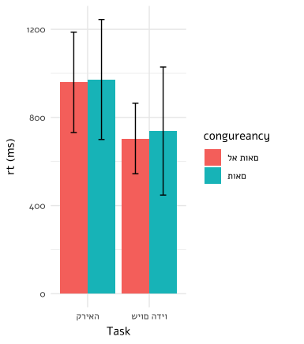

# Stroop Task Data Analysis

### תיאור הפרויקט
פרויקט זה עוסק בניתוח נתונים ממשימת Stroop, כולל שלבים של עיבוד, סינון, וארגון נתונים לצורך ניתוחים סטטיסטיים. הנתונים עובדו באמצעות שפת R, תוך שימוש בפונקציות לניהול נתונים, יצירת משתנים חדשים, סינון תגובות לא תקינות והכנה לניתוח רגרסיה.

---

### מבנה הנתונים
1. **Raw Data**: שלב איחוד הנתונים, יצירת משתנים חדשים, וניקוי בסיסי.
2. **Filtered Data**: סינון תגובות לא תקינות וחישוב סטטיסטיקות עבור המדגם.

---

### מטרות
הכנת הנתונים באופן שמאפשר ביצוע ניתוחים סטטיסטיים כגון רגרסיה, תוך שמירה על נתונים נקיים ומובנים.

